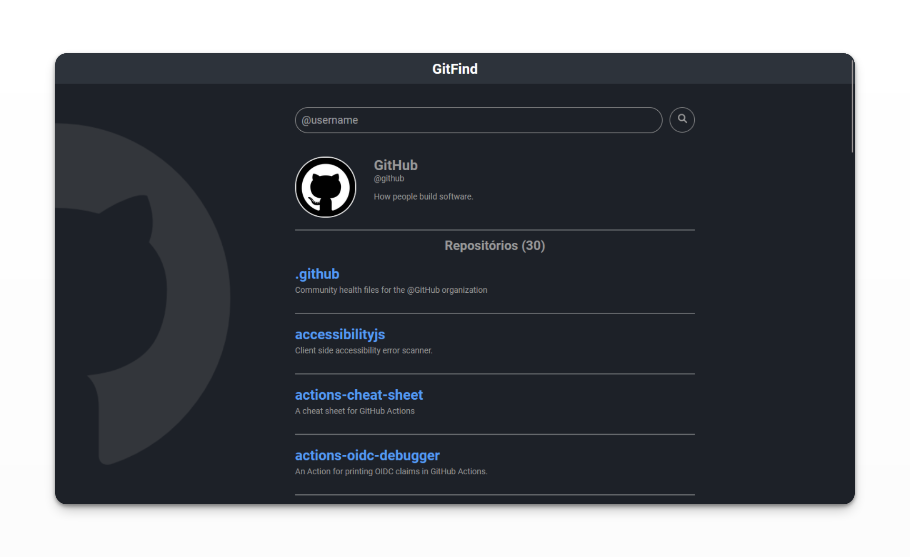

# GitFind

Listagem dos repositórios públicos de usuários do GitHub.

Para isso, foi utilizada a [API do GitHub](https://api.github.com/).

## Utilizado no projeto

- React;
- JavaScript;
- HTML;
- CSS.
